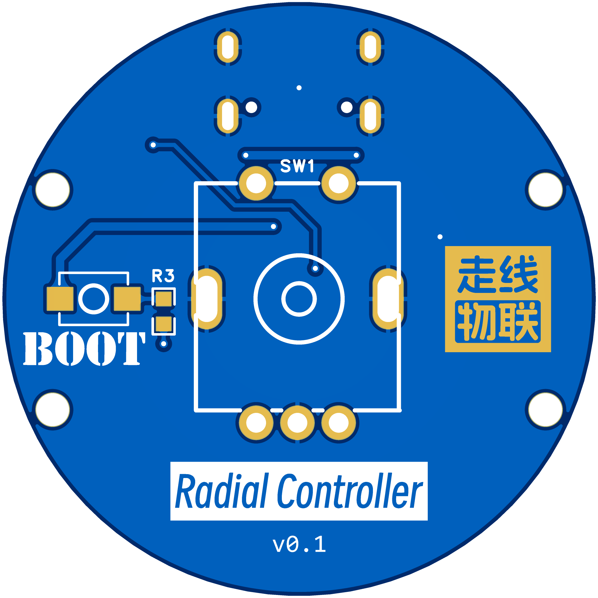
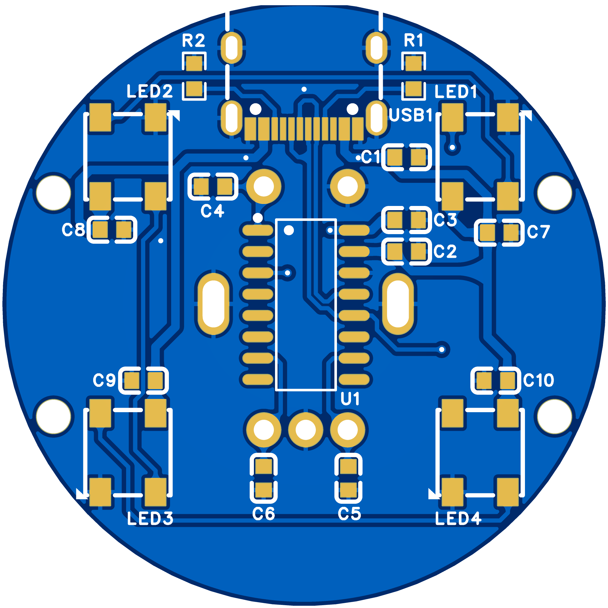
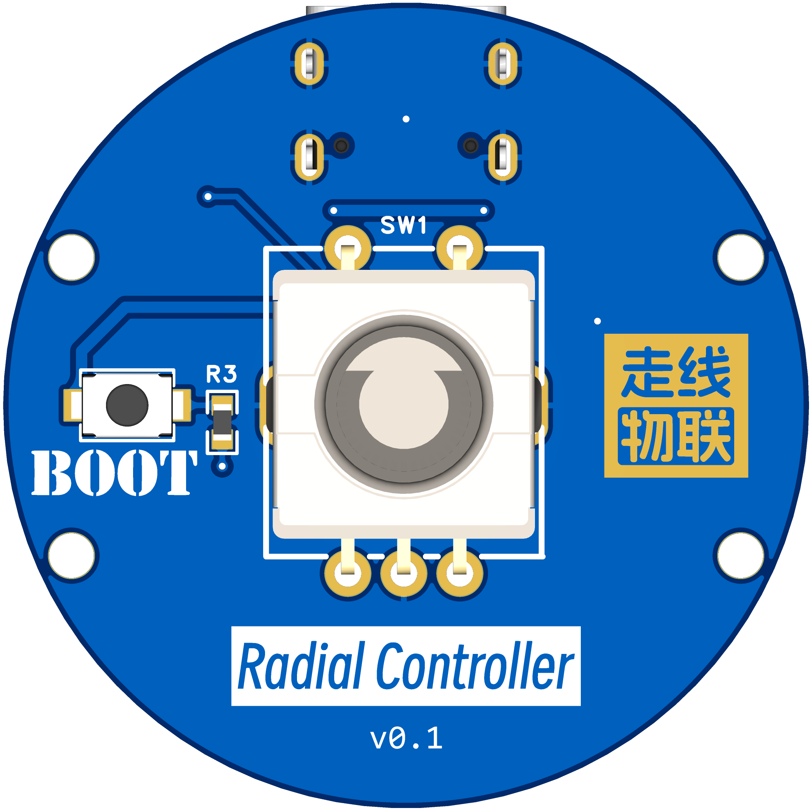
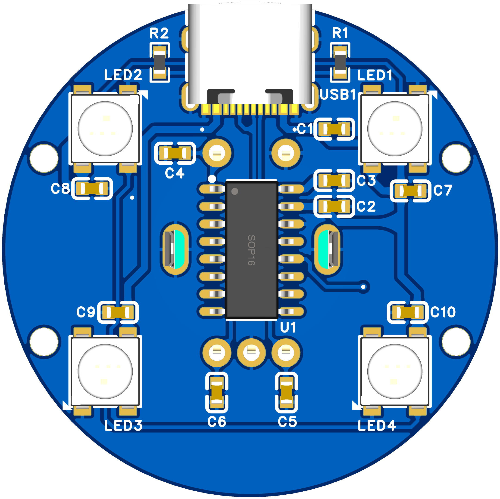
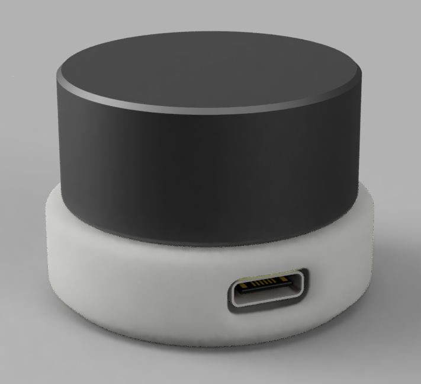
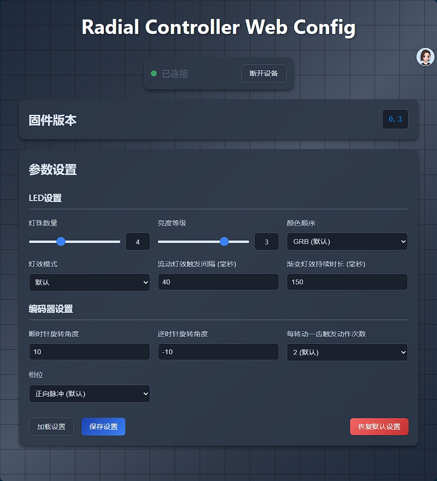

# 资源目录说明

该目录包含了项目中使用的 3D 模型和其他资源文件。

## 1. 其它文档

* [docs/灯效颜色过渡分析.md](./docs/灯效颜色过渡分析.md)：LED 灯效颜色过渡分析文档，包含了颜色过渡的数学计算和实现细节

## 2. 3D 模型文件

* [models/Controller_v4.3mf](https://raw.githubusercontent.com/walklinewang/Radial-Controller/refs/heads/main/resources/models/Controller_v4.3mf)：Bambu Studio 项目文件，已进行简单配置，可直接打印使用
* [models/Controller_v4.f3z](https://raw.githubusercontent.com/walklinewang/Radial-Controller/refs/heads/main/resources/models/Controller_v4.f3z)：Autodesk Fusion 存档文件，上传后可进行二次编辑
* [models/Controller_v4_底壳.stl](https://raw.githubusercontent.com/walklinewang/Radial-Controller/refs/heads/main/resources/models/Controller_v4_底壳.stl)：底壳模型文件
* [models/Controller_v4_上盖.stl](https://raw.githubusercontent.com/walklinewang/Radial-Controller/refs/heads/main/resources/models/Controller_v4_上盖.stl)：上盖模型文件
* [models/Controller_v4_锁止环.stl](https://raw.githubusercontent.com/walklinewang/Radial-Controller/refs/heads/main/resources/models/Controller_v4_锁止环.stl)：锁止环模型文件

> [!NOTE]
> 模型上盖适配的旋转编码器规格：
> 
> - 底座尺寸：11.7mm x 12mm
> - 底座高度：4.5mm
> - 手柄高度：10mm
> - 手柄直径：6mm

> [!TIP]
> 要适配其它高度尺寸，可以在 Fusion 中进行修改（实体 → 修改 → 更改参数）。

## 3. PCB 相关文件

* [pcb/3D_Controller.step](https://raw.githubusercontent.com/walklinewang/Radial-Controller/refs/heads/main/resources/pcb/3D_Controller.step)：PCB 模型文件
* [pcb/Gerber_Controller_v0.1.zip](https://raw.githubusercontent.com/walklinewang/Radial-Controller/refs/heads/main/resources/pcb/Gerber_Controller_v0.1.zip)：PCB 制板文件

## 4. 图片文件

* PCB 2D 预览

    | 正面 | 反面 |
    | :-----: | :----: |
    |  |  |

* PCB 3D 预览

    | 正面 | 反面 |
    | :-----: | :----: |
    |  |  |

* 外壳渲染

    | 外壳 |
    | :-----: |
    |  |

* Web Config 工具网页截图

    | Web Config 工具 |
    | :-----: |
    |  |
